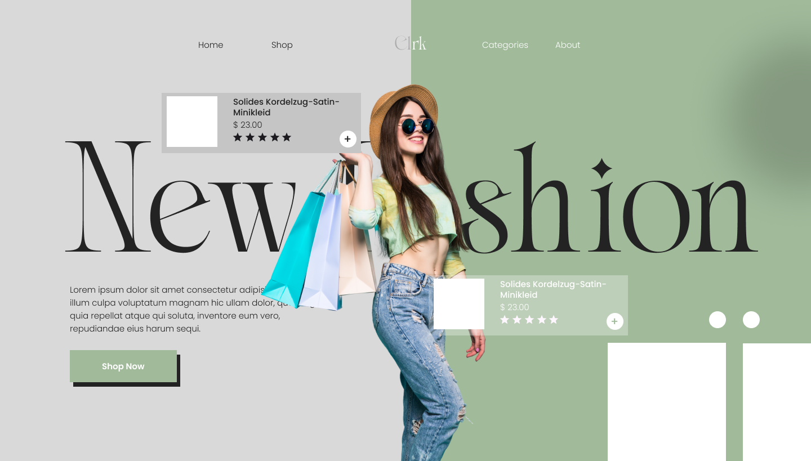

# 🛍️ Clothing E-Commerce Site

A modern and responsive clothing e-commerce website built to showcase stylish apparel and provide a seamless shopping experience.

## 🚀 Features

- 🧥 Browse clothing by categories
- 🛒 Add to cart and manage items
- 🔍 Product search and filtering
- 💳 Checkout flow (UI only/demo)
- 📱 Fully responsive design

## 🛠️ Tech Stack

- **Frontend**: Next.js, React, Tailwind CSS
- **State Management**: Context API / Redux (optional)
- **Icons**: Heroicons / Lucide

## 📸 Preview


## 📂 Folder Structure

```bash
/pages         # Next.js pages
/components    # Reusable UI components
/public        # Static assets
/styles        # Tailwind config & global styles


git clone https://github.com/your-username/clothing-ecommerce.git
cd clothing-ecommerce
npm install
npm run dev


---

Let me know if you'd like to add deployment info (e.g., Vercel link), authentication features, or a logo!
```
